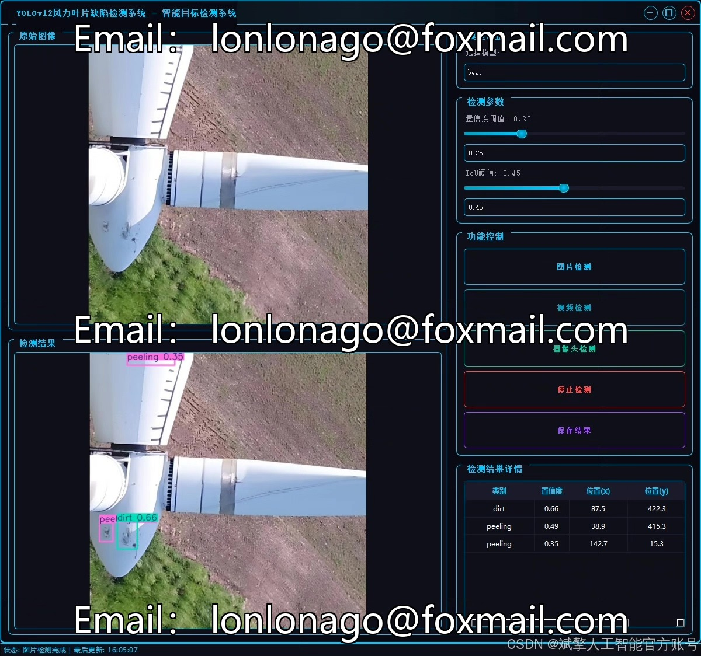
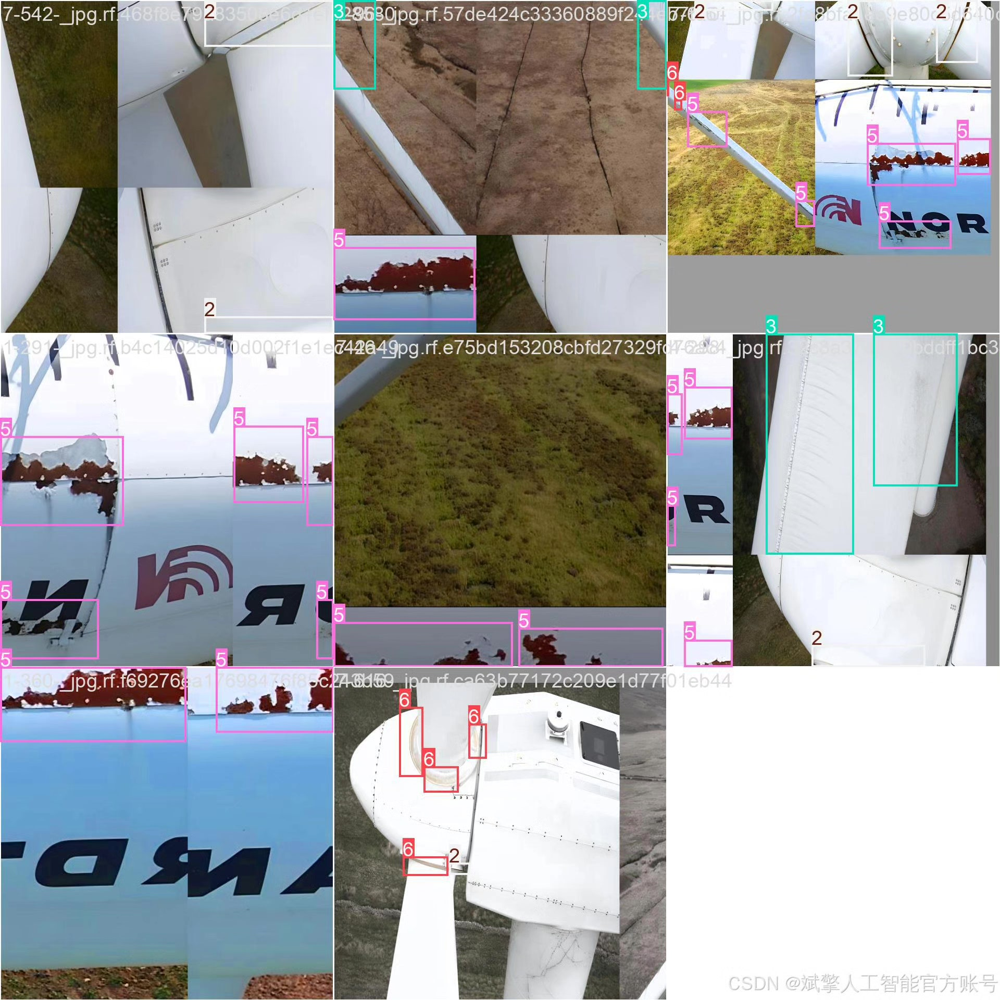
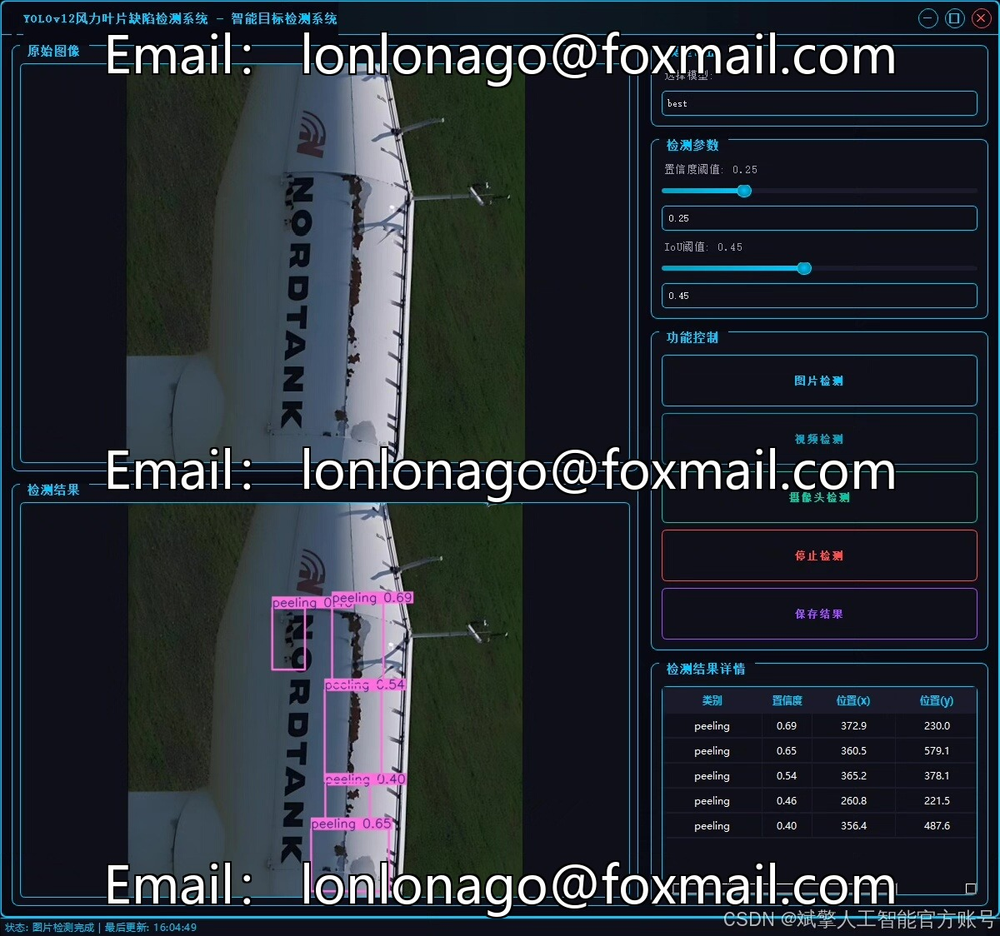
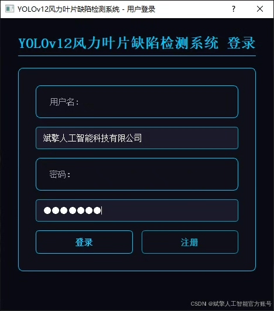
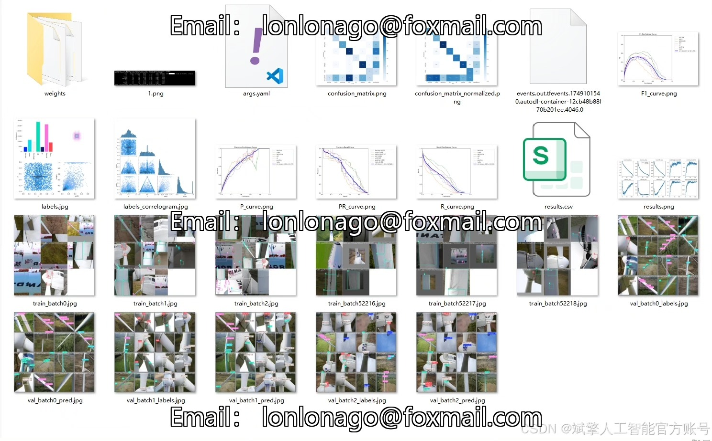
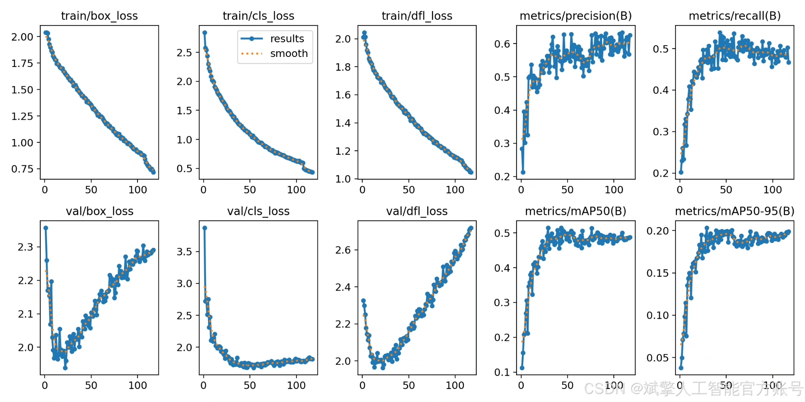
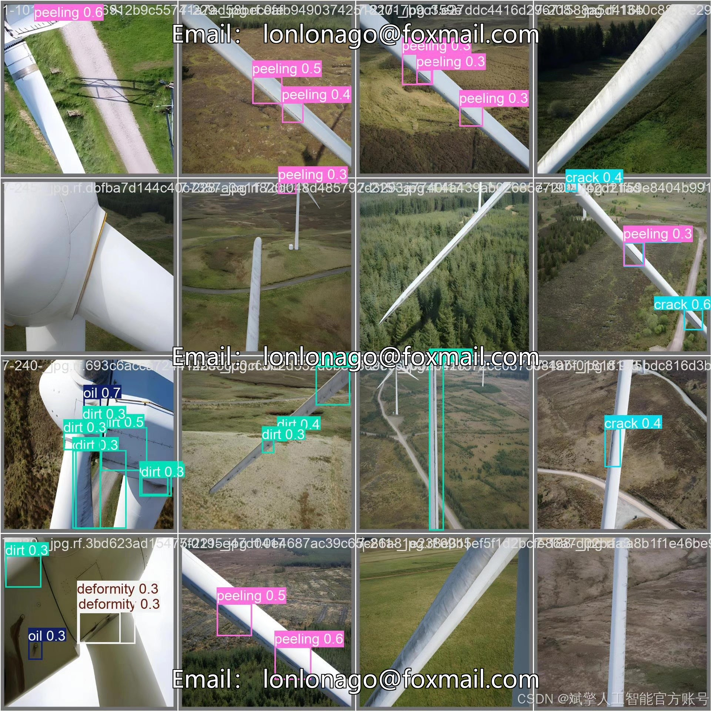

# YOLOv12 Wind Turbine Bladder Defect Detection System

## Body

YOLOv12 Wind Turbine Bladder Defect Detection System Based on Deep Learning YOLOv12: A Smart Detection System for Wind Turbine Bladder Defects (YOLOv12+YOLO dataset + UI interface + login and registration interface + Python project source code + model)

Addressing the issues of low efficiency and high labor costs in detecting defects on the surface of wind turbine blades, this study proposes an intelligent detection system based on the YOLOv12 deep learning algorithm. The system is developed in Python, integrating the YOLOv12 object detection model to achieve precise recognition of seven typical defects on the blade surface (abrasion, crack, deformation, dirt, oil stain, peeling, rust). The experimental data includes a wind turbine blade defect dataset (containing 3898 training images, 380 validation images, and 189 test images), with data augmentation and transfer learning optimized model performance. The system features a user-friendly UI interface supporting login and registration functions.

✅ User Login and Registration: Supports password verification and security validation.
✅ Three Detection Modes: Based on the YOLOv12 model, supports image, video, and real-time camera detection, accurately identifying targets.
✅ Dual-Screen Comparison: Displays the original image and detection results on the same screen.
✅ Data Visualization: Real-time table displays the category, confidence, and coordinates of detected targets.
✅ Intelligent Parameter Tuning: Offers a confidence slide bar to dynamically optimize detection accuracy, adapting to different scene requirements.
✅ Sci-Fi Interactive Interface: Dark theme paired with dynamic light effects, reducing visual fatigue and enhancing operational experience.

## Images

## Payment

Here is a pay link on Stripe ( https://buy.stripe.com/3cs8yP7sY87d0vu9AB ). Please contact me lonlonago@foxmail.com after funding $89, and I will send you a complete data files , thank you!

